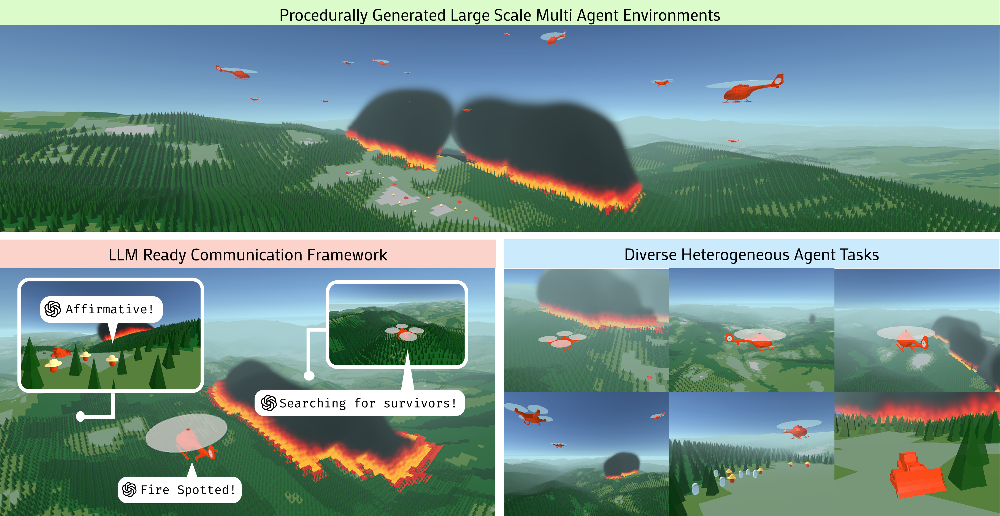
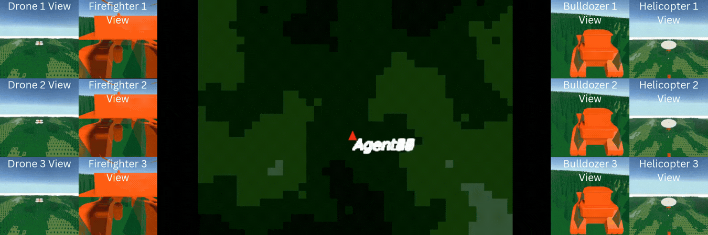
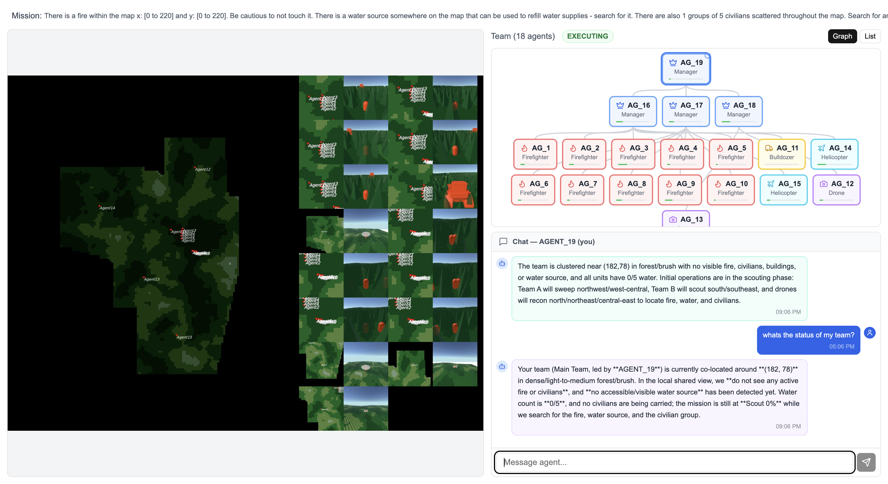

# WILDFIRE-ORCH







The full-stack human-AI teaming interface for CREW-Wildfire and its deployment on AWS with Docker. It takes the wildfire simulation environment ([CREW-Wildfire](https://github.com/generalroboticslab/CREW-Wildfire)) and the ORCH multi-agent algorithm that drives the AI agents ([ORCH](https://github.com/generalroboticslab/ORCH)) and packages them as a website where human players and AI agents fight fires, rescue civilians and manage resources together on a shared map. This repository holds everything needed to run that on your own server: prebuilt containers, a reverse proxy with automatic HTTPS, and a choice between OpenAI's API and a self-hosted model (for example Gemma served with vLLM) so that no API key is needed. For the environment and algorithm research code, see those two repositories; use this one to deploy and play.

This guide takes you from nothing to a running copy on your own Amazon Web Services (AWS) server. You do not need to write or understand code: every command can be copied and pasted as-is.

**Contents**

1. [How it fits together](#how-it-fits-together)
2. [What you need](#what-you-need)
3. [Step 1: Create the server on AWS](#step-1-create-the-server-on-aws)
4. [Step 2: Set up the server (once)](#step-2-set-up-the-server-once)
5. [Step 3: Choose your settings](#step-3-choose-your-settings)
6. [Step 4: Start it and play a first game](#step-4-start-it-and-play-a-first-game)
7. [Everyday use](#everyday-use)
8. [Local models in depth](#local-models-in-depth)
9. [Building your own images](#building-your-own-images)
10. [Running the AI without human players](#running-the-ai-without-human-players)
11. [Troubleshooting](#troubleshooting)
12. [Deleting everything](#deleting-everything)
13. [Repository layout](#repository-layout)
14. [Citation and license](#citation-and-license)

## How it fits together

Everything runs on one AWS server as a set of Docker containers. A container is a ready-made, self-contained package: nothing needs to be installed by hand inside it.

```
                    Internet
                        │  https://your-domain  (or http://your-server-ip)
                        ▼
  ┌─────────────────────────────────────────────────────────────────────┐
  │  Your AWS server (one GPU instance)                                 │
  │                                                                     │
  │   caddy ── front door: HTTPS certificates and routing               │
  │     ├── /          → frontend   the website players use             │
  │     ├── /api/*     → backend    lobbies, roles, player actions       │
  │     └── /nakama/*  → nakama     multiplayer networking (+ postgres)  │
  │                          │                                          │
  │   backend ───HTTP───► algorithm   runs the Unity game engine on the │
  │                          │        GPU and the WILDFIRE AI agents    │
  │                          ▼                                          │
  │             OpenAI API (openai mode)   or   vllm (local model mode) │
  └─────────────────────────────────────────────────────────────────────┘
```

| Container | What it does |
|---|---|
| caddy | Handles HTTPS and forwards each request to the right container. |
| frontend | The website players use. |
| backend | Manages lobbies, collects the human players' actions and relays them to the algorithm. |
| algorithm | Runs the game simulation (Unity, on the GPU) and the WILDFIRE AI agents. |
| nakama, postgres | Multiplayer networking for the game engine, and its database. |
| vllm (optional) | Serves a language model on the GPU when you choose local mode. |

All containers are downloaded ready-made from Docker Hub. You only build them yourself if you change the code (see [Building your own images](#building-your-own-images)).

## What you need

- An AWS account that may create EC2 servers. The server costs roughly $0.50 to $1.90 per hour while it runs (table in Step 1) and can be stopped when not in use.
- A computer with a terminal: macOS, Linux, or Windows with WSL.
- A copy of this repository on that computer:
  ```bash
  git clone https://github.com/generalroboticslab/WILDFIRE-ORCH.git
  cd WILDFIRE-ORCH
  ```
  (or the green **Code** button on GitHub → **Download ZIP**). Only the `deploy/` folder is needed unless you build your own images.
- One of the following:
  - **OpenAI mode:** an OpenAI API key (https://platform.openai.com/api-keys), or let each lobby creator paste their own on the website.
  - **Local model mode:** a free Hugging Face account and access token (https://huggingface.co/settings/tokens). Nothing leaves your server.
- Optional: a domain name, if you want `https://your-domain.com`. Without one you use the server's IP address over plain `http://`.

## Step 1: Create the server on AWS

### 1a. Install the AWS command-line tool

On macOS:

```bash
brew install awscli
```

On other systems follow https://docs.aws.amazon.com/cli/latest/userguide/getting-started-install.html.

Then connect it to your account. Create an access key at https://console.aws.amazon.com/iam/ (your user name, top right → **Security credentials** → **Create access key** → **Command Line Interface**), and run:

```bash
aws configure          # paste the Access Key ID and Secret Access Key; region: us-east-1; output: json
aws sts get-caller-identity   # prints your account id if it worked
```

### 1b. Pick the server size

| You want | Instance type | GPU | Approximate cost (us-east-1, on demand) |
|---|---|---|---|
| OpenAI mode | `g4dn.xlarge` | NVIDIA T4, 16 GB | ~$0.53 per hour |
| Local model, 12B (default) | `g6.xlarge` | NVIDIA L4, 24 GB | ~$0.80 per hour |
| Local model, 31B | `g6e.xlarge` | NVIDIA L40S, 48 GB | ~$1.86 per hour |

Prices change: check https://aws.amazon.com/ec2/pricing/on-demand/ before deciding. The `g4dn.xlarge` cannot run local models (its GPU is too old for vLLM and too small for these models). You are only billed while the server is running; [Everyday use](#everyday-use) shows how to stop it.

If your account has never used GPU instances, AWS may need a one-time limit increase: https://console.aws.amazon.com/servicequotas/ → EC2 → "Running On-Demand G and VT instances" → request at least 4 vCPUs (8 for g6e.xlarge).

### 1c. Create the server

Paste this block into your terminal. Change the first line to match the table.

```bash
INSTANCE_TYPE=g4dn.xlarge        # OpenAI mode.   Use g6.xlarge or g6e.xlarge for local models.

# A login key for the server, saved to your home folder
aws ec2 create-key-pair --key-name wildfire-key --query 'KeyMaterial' --output text > ~/wildfire-key.pem
chmod 400 ~/wildfire-key.pem

# A firewall: SSH only from your current internet address, web traffic from anywhere
SECURITY_GROUP_ID=$(aws ec2 create-security-group --group-name wildfire-sg \
  --description "CREW-Wildfire server" --query 'GroupId' --output text)
MY_IP=$(curl -s https://checkip.amazonaws.com)
aws ec2 authorize-security-group-ingress --group-id $SECURITY_GROUP_ID --protocol tcp --port 22  --cidr ${MY_IP}/32 --output text > /dev/null
aws ec2 authorize-security-group-ingress --group-id $SECURITY_GROUP_ID --protocol tcp --port 80  --cidr 0.0.0.0/0 --output text > /dev/null
aws ec2 authorize-security-group-ingress --group-id $SECURITY_GROUP_ID --protocol tcp --port 443 --cidr 0.0.0.0/0 --output text > /dev/null

# The operating-system image: Ubuntu 22.04 with NVIDIA drivers preinstalled
AMI_ID=$(aws ec2 describe-images --owners amazon \
  --filters "Name=name,Values=Deep Learning Base OSS Nvidia Driver GPU AMI (Ubuntu 22.04) *" \
            "Name=state,Values=available" \
  --query 'sort_by(Images, &CreationDate)[-1].ImageId' --output text)
echo "AMI: $AMI_ID"                 # must print something like ami-0123456789abcdef0, not "None"

# The server itself, with a 200 GB disk
INSTANCE_ID=$(aws ec2 run-instances --image-id $AMI_ID --instance-type $INSTANCE_TYPE \
  --key-name wildfire-key --security-group-ids $SECURITY_GROUP_ID \
  --block-device-mappings '[{"DeviceName":"/dev/sda1","Ebs":{"VolumeSize":200,"VolumeType":"gp3"}}]' \
  --tag-specifications 'ResourceType=instance,Tags=[{Key=Name,Value=wildfire-server}]' \
  --query 'Instances[0].InstanceId' --output text)
echo "Instance: $INSTANCE_ID"
aws ec2 wait instance-running --instance-ids $INSTANCE_ID

# A fixed public address that stays the same when the server is stopped and started
ALLOCATION_ID=$(aws ec2 allocate-address --domain vpc --query 'AllocationId' --output text)
sleep 10
aws ec2 associate-address --instance-id $INSTANCE_ID --allocation-id $ALLOCATION_ID --output text > /dev/null
ELASTIC_IP=$(aws ec2 describe-addresses --allocation-ids $ALLOCATION_ID --query 'Addresses[0].PublicIp' --output text)

# Remember these values for the other steps
cat > ~/.wildfire_aws <<EOF
INSTANCE_ID=$INSTANCE_ID
ELASTIC_IP=$ELASTIC_IP
SECURITY_GROUP_ID=$SECURITY_GROUP_ID
ALLOCATION_ID=$ALLOCATION_ID
EOF
echo "Server address: $ELASTIC_IP"
```

Write down the server address. Whenever a later step says `source ~/.wildfire_aws`, it reloads these values into your terminal.

### 1d. Optional: point your domain at the server

At your domain provider (Cloudflare, Route 53, Namecheap, ...) create two **A** records, both pointing at the server address printed above:

| Name | Type | Value |
|---|---|---|
| `your-domain.com` | A | the server address |
| `www.your-domain.com` | A | the server address |

HTTPS certificates are then obtained automatically once the site is running. If you skip this, you will use `http://<server address>` instead.

## Step 2: Set up the server (once)

Copy the `deploy/` folder from this repository to the server and log in. Run this from the folder that contains this README:

```bash
source ~/.wildfire_aws
scp -i ~/wildfire-key.pem -r deploy/ ubuntu@$ELASTIC_IP:~/wildfire
ssh -i ~/wildfire-key.pem ubuntu@$ELASTIC_IP
```

(The first `ssh` asks whether to trust the server's fingerprint: answer `yes`.)

You are now on the server. Run the setup script:

```bash
cd ~/wildfire
bash setup-server.sh
```

It installs GPU support for Docker, the display server the game engine renders through, and auto-start on reboot, then prints **Setup complete**. This takes a few minutes. If it stops with an error, read the last lines: they say what went wrong.

Afterwards log out and back in once so the Docker permission takes effect:

```bash
exit
```

```bash
source ~/.wildfire_aws
ssh -i ~/wildfire-key.pem ubuntu@$ELASTIC_IP
```

## Step 3: Choose your settings

On the server, create the settings file from the example and open it in the editor:

```bash
cd ~/wildfire
cp .env.example .env
nano .env
```

Fill in the values below, then save with **Ctrl+O**, **Enter**, and leave with **Ctrl+X**. The file explains every line.

**Mode A: OpenAI**

| Setting | Value |
|---|---|
| `SITE_ADDRESS` | `your-domain.com, www.your-domain.com` if you set up a domain, otherwise `http://<server address>` |
| `LLM_PROVIDER` | `openai` |
| `OPENAI_API_KEY` | Your OpenAI key, so nobody has to enter one on the website. Leave empty to have each lobby creator paste their own key instead. Without a domain (plain `http://`) put the key here rather than typing it on the site, so it never travels unencrypted. |

**Mode B: Local model (no API key)**

| Setting | Value |
|---|---|
| `SITE_ADDRESS` | As in mode A |
| `LLM_PROVIDER` | `local` |
| `COMPOSE_PROFILES` | Remove the `#` at the start of the line so it reads `COMPOSE_PROFILES=local-llm` |
| `LLM_MODEL` | `google/gemma-4-12B-it-qat-w4a16-ct` on a g6.xlarge, or `google/gemma-4-31B-it-qat-w4a16-ct` on a g6e.xlarge |
| `HF_TOKEN` | Your Hugging Face access token. Before the first start, open the model's page on https://huggingface.co while logged in and accept the Gemma licence, otherwise the download is refused. |

Everything else can stay at its default.

## Step 4: Start it and play a first game

On the server:

```bash
cd ~/wildfire
docker compose pull       # downloads the containers (about 15 GB; a few minutes)
docker compose up -d      # starts everything and waits until each part reports healthy
docker compose ps         # shows the containers; every one should say "healthy"
```

The first `docker compose up -d` takes two to three minutes in OpenAI mode. In local mode the model is downloaded on the first start, which adds five to fifteen minutes; you can watch it with `docker compose logs -f vllm` (press **Ctrl+C** to stop watching) until it prints `Application startup complete`.

Now open the site in a browser: `https://your-domain.com`, or `http://<server address>` without a domain.

To play a first game:

1. Enter your name. In OpenAI mode without a server-side key, also paste your OpenAI API key (it is stored only in your browser).
2. Click **Quickstart** and pick a scenario. A lobby is created and you are taken to it.
3. Click a role in the team tree to claim it. Other people can join the same lobby from their own browsers by entering your lobby ID on the home page and claiming other roles; unclaimed roles are played by the AI.
4. Click **Start Game**. The game view shows your agent's map and the team, and lets you send actions and chat with the AI agents.

**Create New Lobby** instead of Quickstart lets you pick the level, the seed and the team structure yourself.

## Everyday use

All commands below run on the server in `~/wildfire` unless noted.

**Stop the server when you are not using it.** GPU servers are billed by the hour. From your own computer:

```bash
source ~/.wildfire_aws
aws ec2 stop-instances --instance-ids $INSTANCE_ID     # stops billing for the server (a small charge for the disk remains)
aws ec2 start-instances --instance-ids $INSTANCE_ID    # starts it again; the address stays the same
```

After a start the containers come back on their own; give them about three minutes before opening the site. Games that were in progress are lost, so stop the server between sessions, not during one.

**Look at what is happening:**

```bash
docker compose ps                    # status and health of every container
docker compose logs -f               # all logs, live (Ctrl+C to stop)
docker compose logs -f algorithm     # one container: algorithm, backend, frontend, caddy, nakama, vllm
```

**Restart or change settings:**

```bash
nano .env                 # change settings
docker compose up -d      # applies them (only the affected containers restart)
docker compose restart    # restarts everything without changing anything
```

**Get the newest version of the software:**

```bash
docker compose pull && docker compose up -d
```

**Download game results to your computer** (each game writes its logs, chats and a video under `data/results` on the server):

```bash
source ~/.wildfire_aws
scp -i ~/wildfire-key.pem -r ubuntu@$ELASTIC_IP:~/wildfire/data/results ./wildfire-results
```

**Rebooting** the server is fine: the display server and the containers start automatically.

## Local models in depth

In local mode the `vllm` container serves the Hugging Face model named in `LLM_MODEL` through an OpenAI-compatible interface, and the AI agents talk to it instead of OpenAI. No API key is needed and no game data leaves the server.

**Which model on which server**

| Model (`LLM_MODEL`) | Weights on disk / in GPU memory | Instance | Notes |
|---|---|---|---|
| `google/gemma-4-12B-it-qat-w4a16-ct` | ~8 GB | `g6.xlarge` (24 GB GPU) | Default. Google's official 4-bit build of Gemma 4 12B. |
| `google/gemma-4-31B-it-qat-w4a16-ct` | ~18 GB | `g6e.xlarge` (48 GB GPU) | Google's official 4-bit build of Gemma 4 31B; closest to what the research runs used. |
| Any other model vLLM supports | see its model card | GPU with room for weights + prompts + the game engine | Set `LLM_MODEL` to its Hugging Face name. |

The GPU is shared with the game engine, which needs a few gigabytes for rendering. `VLLM_GPU_MEMORY_UTILIZATION` (default `0.6`) is the share of the GPU the model server may take; the rest stays free for the game. On a 48 GB GPU you can raise it to `0.7`. `VLLM_MAX_MODEL_LEN` (default `32768`) is the longest prompt the model accepts; lowering it frees memory, raising it costs memory.

**Requirements**

- A GPU of the NVIDIA Ampere generation or newer (the g6 and g6e families qualify; the g4dn's T4 does not).
- A driver of version 570 or newer. Check on the server with `nvidia-smi` (top line, "Driver Version"). The Deep Learning AMI from Step 1 comes with a current driver; if yours is older, recreate the server from the newest AMI.
- `HF_TOKEN` set in `.env`, and the Gemma licence accepted once on the model's Hugging Face page while logged in. Without both, the download stops with a "gated repo" or 401 error in `docker compose logs vllm`.

**What to expect**

- The first start downloads the weights into `~/wildfire/data/huggingface`, which is kept across restarts and stops. Later starts take one to two minutes.
- `docker compose ps` shows `vllm` as `starting` until the model is loaded, then `healthy`.
- If a player presses **Start Game** before the model is loaded, the site shows "The local language model is still loading"; wait and press it again.
- Local models are slower than OpenAI's, so AI decisions take longer per turn, especially with many agents.

**Switching between modes:** while the model server is still enabled in `.env`, stop it with `docker compose --profile local-llm stop vllm`, then edit `.env` (`LLM_PROVIDER`, the `COMPOSE_PROFILES` line, `OPENAI_API_KEY`) and run `docker compose up -d`.

## Building your own images

Only needed if you change the code. Otherwise the prebuilt images on Docker Hub are used.

You need, on your own computer: Docker Desktop, a Docker Hub account (`docker login`), and, for the algorithm image, the Unity Linux build of the game:

1. Open the Unity project in `crew-dojo/Unity` with the Unity Editor.
2. Open `Assets/Examples/Wildfire/Configs/NakamaConfig.asset` and make sure **Host** is `172.23.0.50` (the address of the nakama container).
3. **File → Build Settings**: platform **Linux**, architecture **x86_64**, and do **not** tick "Server Build" (the game must render graphics).
4. Build into `crew-dojo/Builds/Wildfire-StandaloneLinux64-Server/`. The result must contain `Unity.x86_64`.

Then, from the folder that contains this README:

```bash
DOCKER_USER=your-dockerhub-name ./build-images.sh
```

This builds the four images for `linux/amd64` (works on Apple Silicon too), pushes them, and rewrites `deploy/docker-compose.yml` so it points at the exact images that were pushed. Copy that file to the server and restart:

```bash
source ~/.wildfire_aws
scp -i ~/wildfire-key.pem deploy/docker-compose.yml ubuntu@$ELASTIC_IP:~/wildfire/docker-compose.yml
ssh -i ~/wildfire-key.pem ubuntu@$ELASTIC_IP 'cd ~/wildfire && docker compose pull && docker compose up -d'
```

The website reaches the backend through the relative address `/api`, so the same frontend image works on any domain or IP address; nothing has to be rebuilt when you move to a different server.

## Running the AI without human players

For experiments you can run a game with AI agents only, straight inside the algorithm container on the server. Results land in `~/wildfire/data/results/logs/<ALGORITHM>/...`.

```bash
docker exec -w /app/crew-algorithms/crew_algorithms/wildfire_alg -e PYTHONPATH=/app/crew-algorithms \
  wildfire-algorithm python -m crew_algorithms.wildfire_alg.algorithms.WILDFIRE \
  envs.level=Suppress_Fire_Contain envs.seed=42
```

- In OpenAI mode `OPENAI_API_KEY` must be set in `.env` for this to work (or add `-e OPENAI_API_KEY=sk-...` after `-e PYTHONPATH=...`).
- In local mode add the model settings to the end of the command: `envs.llm_model=local envs.llm_url=http://vllm:8000/v1 envs.model_name=<the LLM_MODEL from .env>`.
- Level names are the presets defined in `crew-algorithms/crew_algorithms/wildfire_alg/config/build_config.py` (`create_level_presets`), for example `Cut_Trees_Sparse_small`, `Scout_Fire_small`, `Transport_Firefighters_small`, `Rescue_Civilians_Known_Location_small`, `Suppress_Fire_Contain`, `Suppress_Fire_Extinguish`, `Full_Game`.
- The research baselines from the ORCH paper are included and run the same way, with `WILDFIRE` replaced by `COELA`, `CAMON`, `Embodied` or `HMAS_2`. They support OpenAI mode only.

Alternatively, to run AI-only experiments locally, look to ([ORCH](https://github.com/generalroboticslab/ORCH)) for reference.

## Troubleshooting

**The site does not load.**
- Domain: `dig your-domain.com +short` on your computer must print the server address. DNS changes can take up to an hour.
- Firewall: ports 80 and 443 must be open (Step 1c does this).
- Caddy: `docker compose logs caddy --tail=50`. Certificate errors usually mean the DNS record is not live yet.
- Everything healthy? `docker compose ps`. A container stuck on `starting` or `unhealthy`: `docker compose logs <name> --tail=100`.

**`ssh` says "connection timed out" or "permission denied".**
- Your internet address changed since Step 1c (common on home connections). Re-open SSH for the new address:
  ```bash
  source ~/.wildfire_aws
  aws ec2 authorize-security-group-ingress --group-id $SECURITY_GROUP_ID --protocol tcp --port 22 --cidr $(curl -s https://checkip.amazonaws.com)/32
  ```
- The key file must be `~/wildfire-key.pem` with permissions `400`, and the user is `ubuntu`.
- "Host key verification failed" or "REMOTE HOST IDENTIFICATION HAS CHANGED": a server you used earlier had the same address. Forget the old one and try again:
  ```bash
  source ~/.wildfire_aws
  ssh-keygen -R $ELASTIC_IP
  ```

**`docker compose up` refuses to start: "Set SITE_ADDRESS in .env".** Open `.env` and fill in `SITE_ADDRESS` (Step 3).

**The site asks for an OpenAI API key but you run a local model.** `LLM_PROVIDER` in `.env` is not `local`, or the algorithm container was not restarted after changing it: `docker compose up -d`.

**"The local language model is still loading".** Normal for the first ten minutes after a start. `docker compose logs -f vllm` shows progress. If it never finishes: check `HF_TOKEN`, accept the model licence on Hugging Face, and check `nvidia-smi` shows enough free memory.

**"No OpenAI API key provided".** In OpenAI mode either put a key in `.env` (`OPENAI_API_KEY`) or enter one on the home page before creating a lobby.

**Games start but the map images are missing, or the algorithm log says the display cannot be opened.** The display server is not running: `sudo systemctl status wildfire-x`, then `sudo systemctl restart wildfire-x` and `docker compose restart algorithm`.

**The GPU is not visible inside a container** (`docker exec wildfire-algorithm nvidia-smi` fails). Re-run `bash ~/wildfire/setup-server.sh`; it reconfigures Docker's GPU support.

**Lobbies vanish after a restart.** Lobbies live in memory; restarting the backend or the server drops them. Players create a new lobby.

**The disk is full.** Old images and build leftovers can be removed with `docker system prune -f`. Game results accumulate under `~/wildfire/data/results`; download and delete old ones.

**Nakama keeps restarting.** It needs the database: `docker compose logs postgres`. If the database folder got corrupted (for example after a hard power-off), stop everything, move `~/wildfire/data/postgres` aside and start again; nakama recreates it.

## Deleting everything

This removes the server and stops all AWS charges. Download any results first.

```bash
source ~/.wildfire_aws
aws ec2 terminate-instances --instance-ids $INSTANCE_ID
# Wait until the server is fully gone (this can take a couple of minutes)
until [ "$(aws ec2 describe-instances --instance-ids $INSTANCE_ID --query 'Reservations[].Instances[].State.Name' --output text)" == "terminated" ]; do sleep 10; done
aws ec2 release-address --allocation-id $ALLOCATION_ID        # an unused fixed address costs a few dollars a month
# The firewall can only be deleted once the server has released it; retry for a few minutes if needed
until aws ec2 delete-security-group --group-id $SECURITY_GROUP_ID 2>/dev/null; do sleep 15; done
aws ec2 delete-key-pair --key-name wildfire-key
rm ~/wildfire-key.pem ~/.wildfire_aws
```

## Repository layout

```
WILDFIRE-ORCH/
deploy/                  everything that goes on the server: docker-compose.yml, Caddyfile,
                         .env.example, setup-server.sh, systemd units
build-images.sh          builds and publishes the four images (see "Building your own images")
Dockerfile.algorithm     the algorithm image (Unity game engine + WILDFIRE agents)
crew-algorithms/         the WILDFIRE algorithm, the research baselines, and the game service
wildfire-human-interface/  the website (Next.js) and the lobby backend (FastAPI)
crew-dojo/               the Unity game project and the Nakama networking server
assets/                  images used by this README
```

## Citation and license

CREW-Wildfire was created by [Jonathan Hyun](https://github.com/jphyun2019), [Nicholas Waytowich](https://nicholaswaytowich.com/) and [Boyuan Chen](http://boyuanchen.com/) at the Duke University [General Robotics Lab](http://generalroboticslab.com/), on top of the CREW platform by [Lingyu Zhang](https://lingyu98.github.io/), [Zhengran Ji](https://jzr01.github.io/) and Boyuan Chen ([project website](http://www.generalroboticslab.com/CREW)). The WILDFIRE algorithm that drives the AI agents is described in the ORCH paper ([arXiv:2609.11737](https://arxiv.org/abs/2609.11737), [original code](https://github.com/generalroboticslab/ORCH)); the platform is described in the CREW paper ([arXiv:2408.00170](https://arxiv.org/abs/2408.00170)).

If you use this software in your research, please cite all three:

```
@misc{ji2026orchorganizationalprinciplesenable,
      title={ORCH: Organizational Principles Enable Collective Intelligence in Embodied AI},
      author={Zhengran Ji and Jonathan Hyun and Boyuan Chen},
      year={2026},
      eprint={2609.11737},
      archivePrefix={arXiv},
      primaryClass={cs.MA},
      url={https://arxiv.org/abs/2609.11737},
}

@misc{hyun2025crewwildfirebenchmarkingagenticmultiagent,
      title={CREW-WILDFIRE: Benchmarking Agentic Multi-Agent Collaborations at Scale}, 
      author={Jonathan Hyun and Nicholas R Waytowich and Boyuan Chen},
      year={2025},
      eprint={2507.05178},
      archivePrefix={arXiv},
      primaryClass={cs.MA},
      url={https://arxiv.org/abs/2507.05178}, 
}

@inproceedings{zhang2024crew,
      title={CREW: Facilitating Human-AI Teaming Research},
      author={Lingyu Zhang and Zhengran Ji and Boyuan Chen},
      booktitle={Preprint},
      year={2024}
}
```

Released under the Apache 2.0 license (see `LICENSE`).
